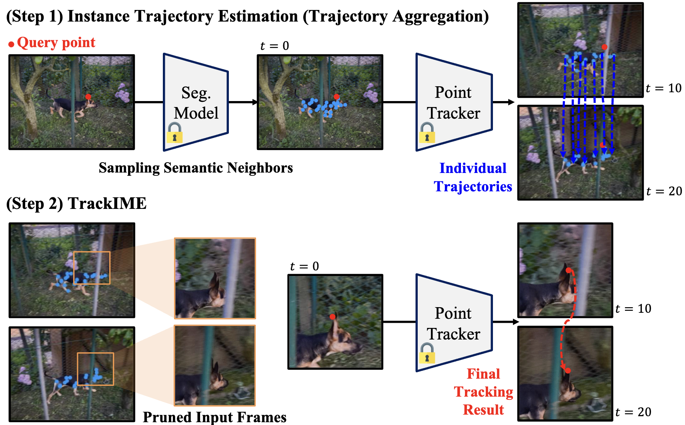

# TrackIME: Enhanced Video Point Tracking via Instance Motion Estimation

This repository is the official implementation of the paper:

[**TrackIME: Enhanced Video Point Tracking via Instance Motion Estimation**](https://trackime-project.github.io)
[*Seong Hyeon Park*](https://www.shpark.org/),
[*Huiwon Jang*](https://huiwon-jang.github.io/),
[*Byungwoo Jeon*](https://rootyjeon.github.io/),
[*Sukmin Yun*](https://sites.google.com/view/sukmin-yun/),
[*Paul Hongsuck Seo*](https://phseo.github.io/),
[*Jinwoo Shin*](https://alinlab.kaist.ac.kr/shin.html/),
NeurIPS, 2024. [**[Project Page]**](https://trackime-project.github.io/)

## TODO
- [ ] Release inference code for point tracking & dataset preparation (est. time: 11/22)
- [ ] Release inference code for segmentation (est. time: 11/22)
- [ ] Release visualization code (est. time: 11/22)
- [ ] Release evaluation code (est. time: 11/22)